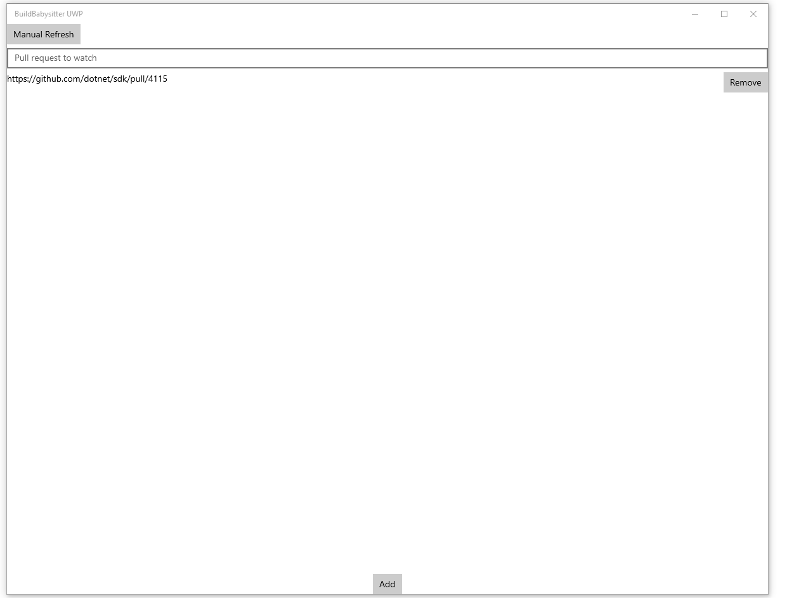

# Build Babaysitter

## Download

[In release page](https://github.com/wli3/BuildBabysitter/releases)

## Features

This application can help you track outstanding Github pull requests statuses. Keep it open, and you can react to the pull request failure or merge it as soon as possible.

The color of the list cell indicates the status of the pull request. Green - all checks passed; red - there is failure in the checks; no color - checks are running and no failure so far. Dark yellow - internal error, it is mostly caused by hitting the github rate limit. Once the pull request status changed, you will receive a notification.

It operates like a todo list. You can add an entry by entering the pull request URL and hit keyboard enter key or add button in the bottom of the application. You can remove the tracking pull request by clicking the remove button on the right of the list cell. The tracking list is stored in local machine.

You can go to the pull request URL by clicking list cell.

## How to build this project

This project uses vanilla [F# Fabulous](https://fsprojects.github.io/Fabulous/Fabulous/) project with Xamarin.Forms. You can build it by using Visual Studio on Windows, Visual Studio for Mac on macOS.

## Github Rate limit

GitHub API has a rate limit of 60 per hour. Currently this application checks every 10 minutes. Each URL requires 2 API calls, so it is likely to hit the limit. I am working on a feature to allow login with Github personal access token (PAT) to increase the limit to 5000 per hour.

## UWP

Unfortunately even though the UWP version of the application is functioning, however the quality is not up to the Microsoft Store and it is not trivial to sideload an UWP app. For Windows you can easy run the WPF version even though it looks much outdated. At the same time, you can build and deploy the UWP version to your local machine.

## Software stack

I am learning F#, Elm like UI architecture, Xamarin.Forms at the same time. The stack is mostly the template of Fabulous.
